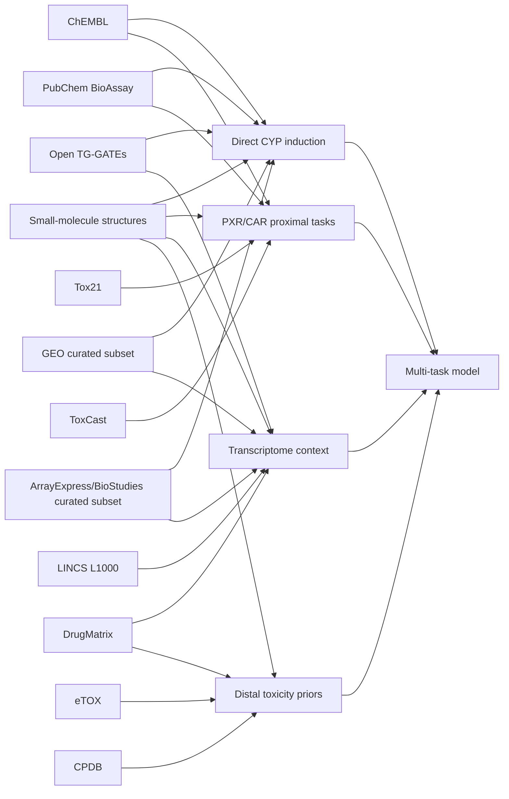

# 小分子によるCYP誘導予測に使える公開データセットの再調査報告

## エグゼクティブサマリー

小分子の CYP 誘導予測に使える公開データを改めて見直すと、**単一の「完成済みベンチマーク」より、近位メカニズムから遠位毒性までの複数データ源を束ねる設計**が最も現実的です。公開資源の中で、**直接 CYP 誘導に最も近い主力**は Open TG-GATEs のヒト in vitro 初代肝細胞 transcriptomics であり、**PXR/CAR の上流メカニズム補助**としては ChEMBL、PubChem BioAssay、Tox21、ToxCast が中心、**転写シグネチャ補助**としては LINCS L1000 と curated GEO / ArrayExpress-BioStudies、**周辺の毒性 prior** としては DrugMatrix と CPDB が位置づきます。eTOX は規模とキュレーションの質が魅力ですが、アクセス条件のため、オープンで再現可能なモデル構築の中核には置きにくい、というのが今回の結論です。citeturn53view0turn54view0turn47search0turn48search2turn49search2turn45search0turn50view1turn5view0turn23view1turn26view3turn26view1turn28view2turn32view0turn33search0turn33search1turn33search8

機械学習の観点では、**主タスク**を「ヒト肝細胞系での CYP3A4 / CYP2B6 / CYP1A2 の発現誘導」に置き、**補助タスク**として「hPXR / rPXR / CAR の reporter / transactivation / binding」「全トランスクリプトーム変化」「細胞生存率」「病理・臨床化学」「種差」を加えるのが最も情報効率の高い構成です。重要なのは、Open TG-GATEs、DrugMatrix、LINCS、GEO、ArrayExpress/BioStudies の多くは**既成の誘導ラベルを配っていない**一方、ChEMBL、PubChem、Tox21、ToxCast は**アッセイ単位の active / inactive、EC50 / AC50、binding readout** を持つことです。したがって、公開データで精度を最大化するには、**直接 CYP 誘導ラベルは少数でも質の高いデータに寄せ、PXR 補助タスクで表現学習を厚くする**方が理にかなっています。citeturn53view0turn52view1turn28view2turn23view2turn26view3turn26view1turn48search2turn49search2turn45search0turn46search0turn50view1turn8view0

本調査範囲では、**公開で大規模・高品質・ヒト初代肝細胞・濃度時間系列・CYP 複数 isoform・タンパク質/酵素活性までそろう単一資源は見当たりません**。そのため、最も堅い設計は、Open TG-GATEs を土台に、ChEMBL / PubChem / Tox21 / ToxCast の PXR/CAR/関連 reporter を統合し、必要に応じて LINCS と curated repository 由来の transcriptomic signatures をドメイン適応・事前学習に使う、という多層設計です。citeturn53view0turn47search0turn45search0turn50view1turn5view0turn23view1turn26view3turn26view1

## 評価枠組み

本報告では、各資源を次の四つの近接度で評価しました。第一に、**直接 CYP 誘導**です。これは CYP3A4 / CYP2B6 / CYP1A2 などの mRNA、タンパク質、酵素活性、あるいはそれに極めて近い肝細胞系 readout を指します。第二に、**受容体近位**で、hPXR / rPXR / CAR の結合、luciferase / β-lactamase reporter、TR-FRET、qHTS transactivation などです。第三に、**転写コンテキスト**で、薬物曝露後の全トランスクリプトームや landmark gene signatures を指します。第四に、**遠位毒性 prior**で、病理、臨床化学、慢性発がん性など、CYP 誘導そのものではないが予測器の表現を安定化しうるデータです。これは各リソースの公式ページが実際に提供している readout の種類に合わせた整理です。citeturn53view0turn28view2turn50view1turn47search0turn49search2turn23view2turn32view0

また、各データセットの「サイズ」は二種類に分かれます。Open TG-GATEs、DrugMatrix、LINCS のような**固定されたダウンロード単位のサイズ**と、PubChem、ChEMBL、GEO、ArrayExpress/BioStudies のような**クエリ依存で切り出すサイズ**です。後者では、リポジトリ全体規模は明記できても、CYP 誘導関連の最終行数は検索語、重複除去、活性値の統合、species/cell filtering に依存するため、その場合は「クエリ依存」または「未指定」と明記しました。citeturn19view1turn13search4turn26view3turn26view1

## データセット俯瞰表

| Dataset | Measured endpoints | Assay type | Samples | URL | ML suitability |
|---|---|---|---|---|---|
| Open TG-GATEs | 全遺伝子発現、cell viability、organ weight、hematology、biochemistry、pathology | ヒト/ラット初代肝細胞 microarray、ラット in vivo microarray | 170化合物、raw CEL は rat 12.0GB / human 53.6GB | `https://dbarchive.biosciencedbc.jp/data/open-tggates/` | 主タスクに最有力。ヒト初代肝細胞 mRNA 誘導を作りやすい。citeturn53view0turn54view0 |
| ChEMBL | hPXR binding、PXR activation、HepG2 での CYP3A4 induction など | 文献由来 binding / functional / cell-based assay | release 36、全体 2.4M structures、PXR target に 641 activities | `https://www.ebi.ac.uk/chembl/` | 高い。直接誘導と受容体近位の橋渡しに向く。citeturn19view0turn19view1turn20search2turn47search0turn48search2turn49search2 |
| PubChem BioAssay | hPXR agonism、human PXR induction、reporter assay など | AID 単位の cell-based / biochemical assays | 例: AID 1347033 は 9,667 compounds | `https://pubchem.ncbi.nlm.nih.gov/bioassay/` | 高いが要キュレーション。AID ごとに直接使える。citeturn45search0turn46search0turn45search1 |
| Tox21 | hPXR/rPXR/CAR reporter、CYP biochemical activity、stress pathway、RNA-seq | qHTS、reporter、biochemical luminescence、transcriptomics | 10K library、>100 assays | `https://tox21.gov/` | 補助タスクに非常に有力。PXR/CAR と CYP 活性がある。citeturn10view0turn50view1 |
| ToxCast | 多様な bioactivity、核内受容体、転写応答、濃度反応 | single/multi-concentration HTS | 約10,000 substances、>1,200 assays | `https://www.epa.gov/chemical-research/exploring-toxcast-data-downloadable-data` | 補助タスクに有力。PXR/CAR 系を注釈で抽出できる。citeturn5view0turn8view0turn8view1turn38search6 |
| DrugMatrix | ラット in vivo/in vitro gene expression、病理、臨床化学、in vitro assay | ラット組織 microarray、初代ラット肝細胞 microarray | 約637 compounds、約700 studies、9.8GB DB | `https://cebs.niehs.nih.gov/cebs/paper/15670` | 高いが種差あり。rat 補助タスクと毒性 prior に強い。citeturn28view0turn28view1turn28view2 |
| LINCS L1000 | small-molecule perturbation transcriptomics | L1000 expression profiling | >1M profiles、phase II は 354,123 profiles | `https://www.ncbi.nlm.nih.gov/geo/query/acc.cgi?acc=GSE92742` / `https://www.ncbi.nlm.nih.gov/geo/query/acc.cgi?acc=GSE70138` | 中程度。転写シグネチャ補助には強いが hepatocyte 性が薄い。citeturn23view1turn23view2turn23view3 |
| GEO | 公開 functional genomics 全般 | microarray / RNA-seq repository | 281,894 series、8,450,381 samples | `https://www.ncbi.nlm.nih.gov/geo/` | curated subset を作れれば有力だが、heterogeneity が大きい。citeturn26view3turn26view4 |
| ArrayExpress/BioStudies | 公開 functional genomics 全般、metadata、raw、processed | repository / archive | CYP 誘導関連 subset はクエリ依存、未指定 | `https://www.ebi.ac.uk/biostudies/arrayexpress` | curated subset 用の源泉として有用。citeturn26view1turn25search6turn51search3 |
| eTOX | 前臨床毒性 study 全般 | curated preclinical tox database | >8,000 studies、約2,000 compounds | `https://www.ihi.europa.eu/projects-results/project-factsheets/etox` | 公開再現研究には低い。アクセス制限が強い。citeturn33search0turn33search1turn33search8 |
| CPDB | 長期動物発がん性、標的臓器、病理、dose-response | chronic animal bioassay compilation | 6,153 experiments | `https://catalog.data.gov/dataset/carcinogenic-potency-database-cpdb-71e86` | CYP 誘導には遠いが、遠位毒性 prior としては使える。citeturn32view0 |

## データセット個票

### Open TG-GATEs

Open TG-GATEs の公開窓口は entity["organization","National Bioscience Database Center","japan db center"] / entity["organization","Japan Science and Technology Agency","japan science agency"] の LSDB Archive です。公式 README は、この資源を「170 compounds に対して、ラット個体およびラット/ヒト肝細胞に曝露したときの gene expression と toxicity を収めたデータベース」と説明し、化合物リストには **Human - in vitro**, **Rat - in vitro**, **Rat - in vivo - Liver/Kidney - Single/Repeat** が明示されています。何を測るかという観点では、中心は Affymetrix の **mRNA microarray** ですが、in vitro では **DNA(%) と LDH(%) の cell viability** があり、in vivo では organ weight、hematology、biochemistry、pathology まで持っています。濃度・時間については、属性表に **DOSE, DOSE_UNIT, SACRIFICE_PERIOD, DOSE_LEVEL (Control / Low / Middle / High)** があり、時点・濃度は実験ごとにメタデータ化されていますが、リポジトリ全体の固定タイムスケジュールを一行で要約する公式表は未指定です。citeturn53view0turn52view1turn52view0turn40view0

形式は **ZIP 化された CEL raw files と TSV 属性表**で、公式 README には rat raw が **12.0GB total**、human raw が **53.6GB total** とあります。主なアクセス先は `https://dbarchive.biosciencedbc.jp/data/open-tggates/`、human raw は `https://dbarchive.biosciencedbc.jp/data/open-tggates/LATEST/Human/`、rat raw は `https://dbarchive.biosciencedbc.jp/data/open-tggates/LATEST/Rat/`、化合物一覧は `https://dbarchive.biosciencedbc.jp/data/open-tggates/LATEST/open_tggates_main.zip` です。ライセンスは **CC BY-SA 2.1 Japan** で、帰属表示と share-alike に加え、論文ではデータベース名と URL を明記する追加条件があります。citeturn53view0turn54view0turn40view0

Multi-Task Learning の適性は、今回の調査対象の中で最も高いと判断します。主タスクは **ヒト初代肝細胞での CYP3A4 / CYP2B6 / CYP1A2 などの発現変化**、補助タスクは **rat in vitro / in vivo のオルソログ発現、DNA/LDH viability、病理・生化学、さらに PXR 標的遺伝子群のシグネチャ**です。ユーザーが求めた「primary hepatocyte vs cell line」の観点でも、Open TG-GATEs は明確に primary hepatocyte 側に寄っているため、レポーター中心の Tox21/ToxCast より生理学的妥当性が高いです。**ML 向け一行評価**: 「公開でここまで human primary hepatocyte の dose/time/toxicity 文脈を持つ資源は稀で、最重要の中核資源。ただし CYP 誘導ラベル自体は自分で設計する必要がある。」という評価です。citeturn53view0turn52view1turn54view0

### ChEMBL

ChEMBL は entity["organization","EMBL-EBI","ebi uk"] が提供する manually curated bioactivity database です。公式ページは、ChEMBL を「bioactive molecules with drug-like properties の curated database」と位置づけ、chemical、bioactivity、genomic data を統合すると説明しています。CYP 誘導予測にとって重要なのは、ChEMBL が単なる一般 bioactivity repository ではなく、**hPXR binding、PXR activation、CYP3A4 induction のような橋渡しアッセイを文献キュレーションで横持ちしている**ことです。公式検索結果では、ヒト PXR に対応する target **CHEMBL3401** に **641 activities** があり、さらに assay 例として「**Agonist activity at human PXR expressed in human HepG2 cells assessed as induction of CYP3A4 measured after 24 h**」や、「**Competitive binding affinity to human PXR LBD (111 to 434) by TR-FRET assay**」が確認できます。つまり、ユーザーが求めた **hPXR binding**、**reporter/functional assays**、**cell line と direct induction の橋** を一つの curated schema の中でまたげるのが ChEMBL の強みです。citeturn19view0turn47search0turn48search2turn49search2turn49search3

形式と規模は極めて扱いやすく、公式ダウンロードは **SQLite / MySQL / PostgreSQL** の DB dump、**SDF**、**FASTA**、RDF、REST API を提供しています。現在リリースとして確認できるのは **ChEMBL 36 (July 2025)** で、NAR の 2023/2024 update では全体規模が **約 2.4 million unique chemical structures** とされています。アクセス先は `https://www.ebi.ac.uk/chembl/`、ダウンロードは `https://ftp.ebi.ac.uk/pub/databases/chembl/ChEMBLdb/latest/`、API は `https://www.ebi.ac.uk/chembl/api/data/docs` です。利用条件は公式トップページにある通り **CC BY-SA 3.0 Unported** です。citeturn19view0turn19view1turn19view2turn20search2

MTL 適性は非常に高いです。主タスクに近いものとして **HepG2 での PXR 依存 CYP3A4 induction** を取り込み、補助タスクとして **hPXR LBD binding (TR-FRET)**、**PXR agonism/antagonism**、さらに文献由来の関連 nuclear receptor assays を加えられます。制約は、文献横断のため **assay heterogeneity** が大きく、同じ「PXR」でも readout、曝露時間、細胞系、濃度レンジが揺れることです。**ML 向け一行評価**: 「curated で再利用しやすく、PXR 結合から CYP3A4 誘導までの連結が強い一方、文献由来ゆえの条件差が最大のノイズ源」です。citeturn48search2turn49search2turn49search3turn19view1

### PubChem BioAssay

PubChem BioAssay は entity["organization","National Center for Biotechnology Information","nih center"] が運営する PubChem の一部で、公式ドキュメントは「small-molecule and RNAi screening data と関連 annotation を収める」と説明しています。CYP 誘導との関係で特に有用なのは、**AID 単位で PXR / CYP 誘導関連アッセイをそのまま切り出せること**です。具体例として、PubChem の検索結果には **AID 1347033 “Human pregnane X receptor (PXR) small molecule agonists: Summary”** があり、**All 9,667 / Active 2,076 / Inactive 6,091** と表示されます。さらに **AID 463086** では「cell-based high-throughput dose response screening assay」で PXR nuclear signaling を測り、「**EC50 ≤ 10 µM なら active**」というルールが確認でき、同じ検索結果には「**A PXR reporter gene assay in a stable cell culture system: CYP3A4 and CYP2B6 induction by pesticides**」という説明も出ます。また **AID 473702** は “Induction of human PXR” として索引されています。これらは、ユーザーが挙げた **PXR-mediated gene expression、reporter assays、direct induction-related assays** そのものです。citeturn11search0turn45search0turn46search0turn44search0turn45search1

形式は柔軟で、レコード単位では **JSON / XML / CSV**、プログラムアクセスには **PUG-REST**、大規模取得には downloads / FTP が用意されています。アクセス先は `https://pubchem.ncbi.nlm.nih.gov/bioassay/`、PUG-REST は `https://pubchem.ncbi.nlm.nih.gov/docs/pug-rest`、downloads は `https://pubchem.ncbi.nlm.nih.gov/docs/downloads` です。利用条件については、PubChem は free to use ですが、NCBI のポリシーは「molecular data に NCBI 自身は再利用制限を置かない一方、元データ提供者の知財主張は NCBI が移転できない」と明記しています。したがって、**オープン再利用は原則可能だが、外部提供データの権利を完全に代行保証してくれるわけではない**、という理解が正確です。citeturn13search4turn11search6turn13search0

MTL の観点では、PubChem は **task-specific extract を最も作りやすい資源**です。主タスク近傍として AID 473702 や CYP3A4/CYP2B6 誘導レポーター系を使い、補助タスクとして大規模 hPXR agonism を追加する設計が自然です。弱点は、AID ごとに assay design が異なり、depositor も多様なため、**重複化合物・多実験統合・曲線品質**の扱いが前処理の本丸になることです。**ML 向け一行評価**: 「PXR/CYP 関連の task-specific labels を大量に取れる最良の公開源の一つだが、AID 横断の harmonization を怠るとノイズが急増する」です。citeturn45search0turn46search0turn13search0

### Tox21

Tox21 は entity["organization","National Center for Advancing Translational Sciences","nih center"] を中核に、entity["organization","U.S. Environmental Protection Agency","us agency"]、entity["organization","National Toxicology Program","us tox program"]、entity["organization","U.S. Food and Drug Administration","us agency"] などが関わる連邦共同プログラムです。公式サイトは、**10K compound library** に 10,000 chemicals を収め、**more than 100 assays** が開発・最適化・スクリーンされたことを述べています。さらに NCATS の公式 assay table では、**Nuclear receptor** の項目に **hPXR, rPXR, CAR** が含まれ、細胞系として **HEK293, HeLa, HepG2**、readout として **β-lactamase reporter / luciferase reporter** が挙がっています。加えて **Cytochrome P450** の項目には **CYP1A2, CYP2C9, CYP2C19, CYP2D6, CYP3A4, CYP26A1** が並び、biochemical luminescence readout として提供されています。つまり Tox21 は、**PXR/CAR の上流活性化**と**CYP 酵素 readout**を同一枠組みで持つ、非常に強い補助タスク源です。citeturn10view0turn50view1

アクセス面でも優秀で、Tox21 public data は **login なしで利用できる**と明記され、data browser、public data、assay descriptions、standard laboratory protocols が利用可能です。phase I だけでも **2,800 compounds / >50 assays** が報告され、全データとプロトコルは公開データベースに格納されるとされています。アクセス URL は `https://tripod.nih.gov/tox21/pubdata` と `https://tripod.nih.gov/tox/assays` が中心です。標準プロトコル集は EPA figshare 上で **CC0** と明示されています。citeturn10view4turn10view2turn9search0turn10view3

MTL 適性は極めて高い一方で、**primary hepatocyte induction ではなく qHTS reporter / biochemical 系が中心**です。したがって、主タスクに置くよりも、**hPXR / rPXR / CAR active-inactive、CYP biochemical activity、stress pathway activation を補助タスクに置く**のが適しています。**ML 向け一行評価**: 「PXR/CAR の近位メカニズムを大量に与えられる公開最高クラスの補助タスク源だが、ヒト初代肝細胞での直接誘導とは assay ontology が異なる」です。citeturn50view1turn10view0turn10view4

### ToxCast

ToxCast は entity["organization","U.S. Environmental Protection Agency","us agency"] の high-throughput toxicology program で、公式説明では **almost 10,000 substances** を **more than 20 high-throughput assay sources** により **over 1,200 assays** で tested としています。公式 downloadable-data ページでは、assay endpoint の一覧が **single-concentration** と **multiple-concentration** の両方で CSV / Excel 形式で提供され、**invitroDB** とその assay annotations が最新版として配布され、さらに **CompTox Bioactivity API** が invitroDB v4.2 ベースで使えると説明されています。つまり ToxCast は、化学構造と濃度反応パラメータを大規模に扱いたい場合の**最も実務的な HTS 資源**です。citeturn5view0turn8view0turn8view1

PXR/CYP 誘導の観点では、公式ページ自体は assay 名の長い一覧を要約していませんが、公開された ToxCast assay outputs を使った二次解析には **ATG_PXR_TRANS_up / dn** や **NVS_NR_hPXR** のような PXR 関連エンドポイントが現れています。したがって、ToxCast そのものは **PXR/CAR 系を assay annotations から抽出して補助ラベル化する**用途に向きます。ただし、これらは primary hepatocyte の direct induction ではなく、**transactivation / nuclear receptor pathway の近位 readout**という位置づけです。アクセス URL は `https://www.epa.gov/chemical-research/exploring-toxcast-data-downloadable-data`、assay endpoint page は `https://comptox.epa.gov/dashboard/assay-endpoints`、figshare の ToxCast/Tox21 protocol bundle は CC0、EPA の CompTox API / data は free of all copyright restrictions とされています。citeturn8view0turn8view1turn10view3turn7search12turn38search6

MTL では、ToxCast は **PXR/CAR の近位補助タスク**、あるいは **cytotoxicity-aware multitask** に向きます。Open TG-GATEs や ChEMBL/PubChem の direct induction と組むと、上流の nuclear receptor 活性を緩く拘束できるのが利点です。**ML 向け一行評価**: 「規模と化学多様性は抜群だが、CYP 誘導の主タスクには遠く、受容体近位の representation learning に使うのが最適」です。citeturn5view0turn8view1turn38search6

### DrugMatrix

DrugMatrix の公式配布は CEBS 経由で、所有・公開主体は entity["organization","National Institute of Environmental Health Sciences","nih institute"] / entity["organization","National Toxicology Program","us tox program"] 側の CEBS です。公式ページには、**Complete DrugMatrix Database (Postgres version, 9.8 GB)**、histopathology、clinical chemistry / hematology、in vitro assay data、normalized data、differential gene expression data が並びます。DrugMatrix ApicalXOmics の公式説明では、DrugMatrix は **~637 compounds、~700 short-term studies、~4,000 dose-time-tissue combinations、~13,000 Codelink arrays、~5,000 Affymetrix arrays、~127,000 histopathology measurements、~100,000 hematology/chemistry measurements、~130 in vitro assays** を含むとされています。これは、CYP 誘導そのものよりも、**薬物応答の毒性背景まで込みで modeling したい場合**に大きな価値があります。citeturn28view0turn28view2

CYP 誘導との直接的な関係は、まず **初代ラット肝細胞の in vitro microarray** です。GEO mirror の sample page では、primary rat hepatocyte に対し、化合物名、dose、time（例 0.67 d, 1 d）、vehicle、platform が明示されており、Series として **GSE57805** が in vitro rat hepatocyte、**GSE57815** が rat liver を提供しています。rat liver 系では **~600 compounds**, **2218 samples**, **0.25 / 1 / 3 / 5 days** の daily dosing design が明示されているので、短期毒性と transcriptomics を大規模に結びつけた補助データとして極めて便利です。ヒトではなく rat 中心なので、**human induction の主ラベル**ではなく、**species transfer / auxiliary task / prior** として使うのが自然です。citeturn28view1turn43search1turn43search2

アクセス先は `https://cebs.niehs.nih.gov/cebs/paper/15670`、GEO mirror として `https://www.ncbi.nlm.nih.gov/geo/query/acc.cgi?acc=GSE57805` や `https://www.ncbi.nlm.nih.gov/geo/query/acc.cgi?acc=GSE57815` が使えます。利用条件は CEBS が public resource であり、Terms of Use の要約では、公開済み dataset を使うときは**acknowledgement を求める**とされていますが、標準的なオープンライセンス名は明示されていません。したがって利用条件は「**公開利用可だが、標準化された permissive license は未指定**」と書くのが妥当です。citeturn29search1turn29search0turn28view0

MTL 適性は高いです。具体的には **rat hepatocyte transcriptome** を CYP 誘導の species-auxiliary task に、**rat liver / kidney transcriptome** を in vivo transfer に、**histopathology / hematology / chemistry** を遠位補助タスクに置けます。**ML 向け一行評価**: 「毒性文脈つきの大規模 short-term toxicogenomics として非常に強力だが、ヒト直接誘導の主タスクには species gap が残る」です。citeturn28view2turn28view1

### LINCS L1000

LINCS L1000 は entity["organization","Broad Institute","cambridge ma us"] を中心とする LINCS の perturbational transcriptomics 基盤で、公式の CLUE / GEO ガイドは **all LINCS-funded CMap L1000 data is publicly available in GEO** と述べています。CLUE の説明では CMap L1000 は **more than 1 million profiles** に成長しており、GEO accession として **GSE92742**（Phase I）と **GSE70138**（Phase II）が主要入口です。GEO の GSE92742 / GSE70138 ページは、small-molecule と genetic perturbagens を human cultured cells に投与し、L1000 assay で raw fluorescence から differential expression signature へ変換した **Level 1–5** のデータ層を持つことを説明しており、Phase II には **354,123 profiles** が載っています。citeturn23view1turn23view2turn23view3

何を測るかは**直接 CYP 誘導ではなく transcriptome pattern**です。肝特異性は限定的で、細胞種は多くが cultured human cell lines です。そのため、CYP 誘導の主タスクには遠い一方、**PXR target gene signature** や **drug-response manifold** を学習する補助タスクとしては極めて魅力的です。形式は GEO family SOFT / MINiML / matrix に加え、supplementary files として **LXB, GCT, GCTX** があり、Phase II では raw LXB が **223.0 GB**、Level 2 GEX が **637.9 MB**、Level 3 inferred matrix が **12.6 GB** と示されています。アクセスは `https://www.ncbi.nlm.nih.gov/geo/query/acc.cgi?acc=GSE92742`、`https://www.ncbi.nlm.nih.gov/geo/query/acc.cgi?acc=GSE70138`、CLUE ガイドは `https://clue.io/geo-guide` です。GEO 側の bulk data は公開ですが、CLUE infrastructure の API key や developer resources にはアカウントと再配布制限があります。citeturn23view2turn23view3turn24search5turn24search0

MTL では、**全トランスクリプトーム/landmark transcript の自己教師あり表現学習**や、**薬物 perturbation signature から PXR/CYP 誘導へ transfer**する用途が向きます。**ML 向け一行評価**: 「規模は巨大で pretraining 向きだが、hepatocyte 生理に近い direct induction labels ではないため、主タスクではなく representation learning 用と割り切るのが良い」です。citeturn23view1turn23view2turn23view3

### GEO

GEO は entity["organization","National Center for Biotechnology Information","nih center"] が提供する public functional genomics repository です。公式トップページでは **Series: 281,894**、**Samples: 8,450,381** が示され、download page は SOFT / MINiML / matrix / supplementary file など複数形式で落とせること、programmatic access page は FTP の典型パスを提示しています。つまり GEO は、CYP 誘導研究の**単一データセット**ではなく、**検索語で task-specific corpus を作るための源泉リポジトリ**です。citeturn26view3turn26view4turn26view5

この集合には、rifampicin、PXR agonists、HepaRG、primary human hepatocytes などを含む多数の公開研究が潜んでいますが、repository レベルでは **CYP isoform、cell system、濃度、時間点、binary/quantitative label は study dependent** であり、一括では未指定です。したがって、GEO を model-ready dataset と呼ぶのは正しくなく、**curated extraction pipeline** が必要です。アクセス先は `https://www.ncbi.nlm.nih.gov/geo/` で、利用条件は NCBI の一般方針に従います。NCBI は molecular data に自ら再利用制限を置かない一方、データ提供者の知財主張を一律に消すわけではありません。citeturn26view3turn13search0

MTL の観点では、GEO は **primary hepatocyte / HepaRG / HepG2 の transcriptomics** を curated subset として作る際に最も強力です。弱点は厳しい heterogeneity で、platform、normalization、species、dose schedule が study ごとにずれます。**ML 向け一行評価**: 「原石としては巨大だが、前処理設計こそが性能を決める典型的な repository」です。citeturn26view3turn26view4turn13search0

### ArrayExpress と BioStudies

ArrayExpress は現在 entity["organization","EMBL-EBI","ebi uk"] の BioStudies collection に統合されています。EMBL の公式 announcement は **ArrayExpress interface retired** とし、すべての datasets が **BioStudies ArrayExpress collection** に移行したと説明しています。現行の ArrayExpress/BioStudies ページは、機能ゲノミクス実験の metadata、sample annotations、protocols、processed data、raw data を再利用用に保持し、sequence raw reads は ENA へ broker すると述べています。したがって GEO と同様、これは単一 benchmark ではなく、**EBI 側の functional genomics source repository** です。citeturn25search2turn26view1turn25search11

形式とアクセスは充実しており、**FTP / Aspera**、Bioconductor package、そして **BioStudies API** が提供されています。アクセス先は `https://www.ebi.ac.uk/biostudies/arrayexpress` と `https://www.ebi.ac.uk/biostudies/arrayexpress/help` です。ライセンスは一律ではなく、BioStudies help は「**new datasets are released into the public domain under CC0; some older studies have individual licenses; where no license is stated, data are available under the EMBL-EBI Terms of Use**」と説明しています。つまり、**新規公開データは CC0 に寄るが、旧データや外部由来 study では record-level license を必ず確認すべき**というのが正確な理解です。citeturn25search6turn51search3turn51search1

CYP 誘導の観点では、GEO と同じく **query-derived subset** として使うべきで、repository 全体での assay type、species、time points、label type は未指定です。ただし EBI 系は metadata まわりと bulk access が強いので、**大規模 transcriptomics corpus の構築元**として有用です。**ML 向け一行評価**: 「GEO と並ぶ curated-corpus 生成の源泉で、特に EBI API / bulk access が便利。ただし unit of analysis は study であり、そのままでは benchmark ではない」です。citeturn26view1turn25search6turn51search3

### eTOX

eTOX は entity["organization","Innovative Health Initiative","eu partnership"] 側の official fact sheet で、**eTOXsys contains information from over 8,000 toxicity studies on almost 2,000 compounds** と説明されています。さらに project publication は、13 社の製薬企業の toxicology department にある paper / PDF archive から前臨床研究データを抽出し、detailed curated database と predictive models の基盤にするのが目的だったと述べています。規模と curated quality だけを見れば、前臨床毒性資源として非常に魅力的です。citeturn33search0turn33search13

しかし、公開利用という観点では制約が大きく、eTOX project の説明や関連文献は、**web services not exposed to the public**、**final system behind corporate firewalls** と記しています。さらに FAIR-sharing のガイドライン類では、data donor が自分の IP を保持し、third-party access は donor ごとの negotiation や internal review に依存するとされます。したがって、eTOX は「公開データセット」としては弱く、少なくとも**Open TG-GATEs や Tox21 のように即時再現可能な public benchmark ではない**と明確に言うべきです。形式・ダウンロード方法・標準ライセンスは、公開利用者向けには未指定です。citeturn33search1turn33search8

MTL の観点では、もしアクセスできるなら preclinical safety prior や organ toxicity 補助タスクとして魅力がありますが、オープンな drug-discovery ML の基盤には置けません。**ML 向け一行評価**: 「データの質と規模は魅力的だが、公開再現性が弱いため、オープン研究の中心には不向き」です。citeturn33search0turn33search1turn33search8

### CPDB

CPDB の現行の公開カタログは entity["organization","National Library of Medicine","us medical library"] 系の open catalog で、**45 years of chronic, long-term carcinogenesis bioassays** をまとめた standardized resource と説明されています。公式 catalog では **6153 experiments** が含まれ、strain、sex、route、target organ、histopathology、author’s opinion、statistical significance、tumor incidence、dose-response curve shape などが記録されるとされています。これは CYP 誘導そのものではありませんが、**xenobiotic response の遠位転帰**を扱う長期毒性資源として位置づけられます。citeturn32view0

アクセスは `https://catalog.data.gov/dataset/carcinogenic-potency-database-cpdb-71e86` から documentation と data download へ飛べます。利用条件は public access で、catalog metadata には **ODbL** が記載されています。また、この dataset は **no-longer updated with new content** と明記されているので、現代的な誘導予測の主資源ではなく、歴史的・補助的な位置づけになります。citeturn32view0

MTL では、CPDB は **遠位 toxicity prior** としてのみ使うべきです。CYP 誘導との距離が遠く、species も chronic rodent carcinogenicity が中心なので、主タスクに近い supervision には向きません。**ML 向け一行評価**: 「公開性は高いが、エンドポイントが遠すぎるため、使うなら toxicity-aware regularization 用の補助 prior に限る」です。citeturn32view0

## マルチタスク学習への写像

以上の資源をタスクへ写像すると、次の構造になります。図は、各公式リソースが提供している readout を、**direct induction**, **proximal receptor tasks**, **transcriptome context**, **distal toxicity priors** に整理したものです。Open TG-GATEs と curated GEO / BioStudies 抽出は主タスク、ChEMBL / PubChem / Tox21 / ToxCast は近位補助、LINCS は表現学習、DrugMatrix / CPDB / eTOX は毒性補助に寄る、という構図です。citeturn53view0turn47search0turn45search0turn50view1turn5view0turn23view1turn26view3turn26view1turn28view2turn32view0turn33search0

実装上は、ラベル空間を少なくとも五つに分けるのがよいです。第一に **human hepatocyte transcript induction** で、Open TG-GATEs human in vitro と curated GEO / BioStudies subsets を使います。第二に **hPXR / rPXR / CAR reporter or transactivation** で、Tox21 と ToxCast、PubChem、ChEMBL を使います。第三に **hPXR binding** で、ChEMBL の TR-FRET や Binding 型 assay を置きます。第四に **whole-transcriptome perturbation signatures** で、LINCS と Open TG-GATEs / DrugMatrix を使います。第五に **viability / pathology / chemistry** で、Open TG-GATEs と DrugMatrix を使います。これにより、CYP 誘導予測器は「PXR を活性化するが細胞毒性が強い化合物」と「PXR を強く動かし、最終的に CYP3A4 mRNA も上がる化合物」を分けて学習しやすくなります。citeturn52view0turn53view0turn28view2turn48search2turn49search2turn45search0turn50view1turn23view2

なお、ラベルの統一方針では、Open TG-GATEs / DrugMatrix / GEO / ArrayExpress は**連続値**、ChEMBL / PubChem / Tox21 / ToxCast は**連続値と二値が混在**、CPDB は**遠位カテゴリ/連続的 potency** という非対称性があります。最終的な multitask head は、「回帰 head（fold-change, AC50/EC50, binding affinity）」と「分類 head（active / inactive）」を混在させる設計が合理的です。特に Open TG-GATEs と ChEMBL / PubChem の橋渡しには、**同じ化合物で“hPXR activation → CYP3A4 induction”が連鎖するか**を学ぶ構造が有用です。citeturn53view0turn48search2turn49search2turn45search0turn46search0

## 結論

今回の再調査で、**公開データだけで CYP 誘導予測を行う場合の最優先資源**は Open TG-GATEs です。理由は、ヒト初代肝細胞、用量・時間メタデータ、cell viability、ラット in vitro / in vivo 補助、病理・血液学まで揃っているためで、直接誘導に最も近い supervision を与えられるからです。続く優先資源は、**ChEMBL と PubChem BioAssay** です。両者は hPXR binding、PXR agonism、HepG2 での CYP3A4 induction などを提供し、Open TG-GATEs の transcriptomics と Tox21/ToxCast の qHTS をつなぐ役割を果たします。citeturn53view0turn54view0turn47search0turn48search2turn49search2turn45search0turn46search0

その次に重要なのが、**Tox21 と ToxCast** です。どちらも primary hepatocyte 誘導そのものではありませんが、hPXR/rPXR/CAR と CYP biochemical activity という上流メカニズムを大量に供給できます。モデルが chemical structure から直接 CYP 誘導を学ぶにはラベルが少なすぎるため、この上流タスクは事前学習・正則化・パラメタ共有にとって本質的です。citeturn50view1turn5view0turn8view1turn38search6

最後に、**LINCS、GEO、ArrayExpress/BioStudies、DrugMatrix、CPDB、eTOX** は、主タスクの代替ではなく役割分担が必要です。LINCS は表現学習、GEO と ArrayExpress/BioStudies は curated corpus 構築、DrugMatrix は rat/toxicology 補助、CPDB は遠位 toxicity prior、eTOX は将来的な高品質補助だが公開再現性に制約、という位置づけが妥当です。したがって、公開データだけで最も堅い設計は、**Open TG-GATEs を中心に、ChEMBL / PubChem / Tox21 / ToxCast を補助に重ねる多タスク学習**です。これが、今回の再調査に基づく最も実装可能で厳密な結論です。citeturn23view1turn26view3turn26view1turn28view2turn32view0turn33search0turn33search1turn53view0turn47search0turn45search0turn50view1turn5view0