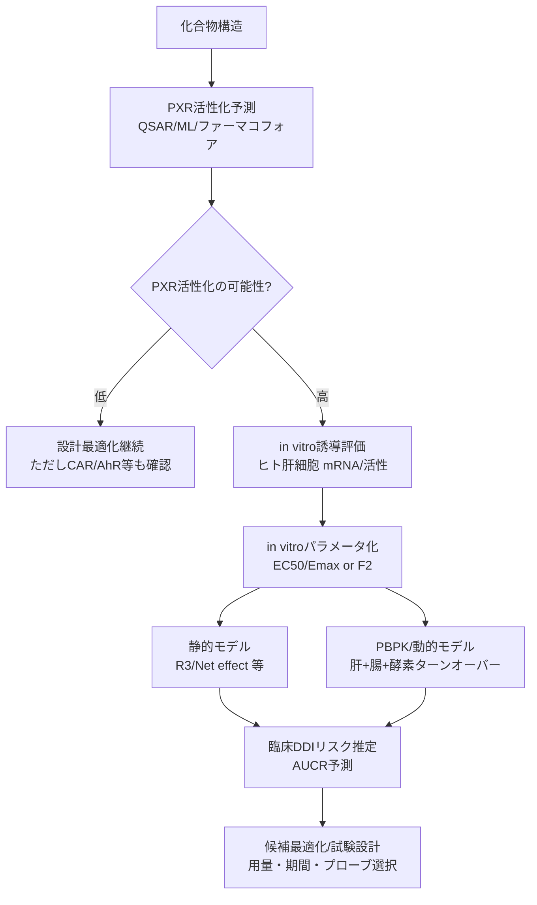

# 創薬における低分子のCYP誘導・PXR活性化予測の研究事例（2011–2026）

## エグゼクティブサマリ

- 2011年以降、**PXR活性化（＝CYP3A誘導リスクの主要ドライバー）をin silicoで分類・回帰する研究**と、**ヒト肝細胞in vitro誘導データから臨床DDI（AUC変化）を定量予測するIVIVE/PBPK研究**が並行して発展している。[1](https://pubmed.ncbi.nlm.nih.gov/21068194/)  
- **PXR予測（化学構造→活性）**は、ナイーブベイズ/Random Forest/SVM/決定木＋特徴選択/構造ベース・ファーマコフォア等で、内部検証では概ね**AUC ≈0.8前後・accuracy 0.7–0.9**の範囲が多い。一方で**化学空間のシフト（外部集合・構造的に遠い化合物）で性能が落ちやすい**ことが実証され、汎化・適用領域（AD）の扱いが主要課題である。[2](https://www.mdpi.com/2073-4409/11/8/1253)  
- **PXR活性とCYP3A4誘導の相関**は、(i) 大規模薬剤プロファイリングで「hPXR活性化とCYP3A4誘導が最も相関」すること、(ii) 13薬剤で「肝細胞CYP3A4 mRNA誘導とDPX2（PXRレポーター）活性が線形相関」することが報告される一方、**種差（ヒトPXR vs ラットPXR）や、PXR活性化≠必ずしもCYP3A4活性増加**などの不一致も示される。[3](https://www.sciencedirect.com/science/article/abs/pii/S0090955624224090)  
- 臨床DDI予測では、**mRNA誘導パラメータ（EC50/Emax等）と曝露（Cmax、free Cmax等）を結ぶ静的モデル**が「偽陰性を抑える」用途で有効で、PBPK/動的モデルは入力パラメータが増える分**モデルの信頼性評価・検証・標準化**が重要になる。[4](https://www.researchgate.net/profile/Odette-Fahmi/publication/256331818_Evaluation_of_Various_Static_and_Dynamic_Modeling_Methods_to_Predict_Clinical_CYP3A_Induction_Using_In_Vitro_CYP3A4_mRNA_Induction_Data/links/543e7f1f0cf2eaec07e644e4/Evaluation-of-Various-Static-and-Dynamic-Modeling-Methods-to-Predict-Clinical-CYP3A-Induction-Using-In-Vitro-CYP3A4-mRNA-Induction-Data.pdf)  
- 公開データは**PubChem/ToxCast/NPC（NIH薬剤コレクション）**を起点に増えているが、創薬企業の内部化合物（誘導データ）は非公開が多く、**外部検証・再現性・説明可能性**を阻害している。[5](https://www.mdpi.com/2073-4409/11/8/1253)  

## 調査範囲と検索方法

2011年以降（直近15年以内）を対象に、**査読論文**を主として抽出した。検索の主軸はPubMed、Google Scholar、Web of Science相当の索引情報（抄録・出版社ページ・オープンアクセスPDF）で、キーワードは「PXR activation prediction」「CYP3A4 induction prediction」「hepatocyte induction」「PBPK induction」「QSAR PXR」「pharmacophore PXR」等を組み合わせた。プレプリントは原則除外し、本 रिपोर्टに含めた事例はすべて査読論文（または規制文書）である。[6](https://pubmed.ncbi.nlm.nih.gov/21068194/)  

不明点（例：一部論文のコード公開有無、補足データの完全なURL）は、原著の本文・補足情報に直接アクセスできない場合があるため、**「未確認」または「原著に記載がある前提」**として明記した（該当行に注記）。

## 主要論文の事例一覧

### PXR活性化・PXR結合・CYP3A4誘導を「化学構造から予測」した研究（in silico中心）

| ID | 著者・年 | 雑誌 | 目的（CYP誘導 / PXR） | 実験/計算手法（データ規模・特徴量・モデル） | 評価指標と性能 | 利点と限界 | データ/コード公開（URLは後掲） | 主要ソース |
|---|---|---|---|---|---|---|---|---|
| P1 | Yongmei Pan et al., 2011 | Drug Metab Dispos | PXR（hPXR）活性化予測＋in vitro確認 | 低分子薬剤DB（SCUT）を対象にリガンドベースVS。**Bayesian分類**：学習データ177化合物、**fingerprints＋117構造記述子**。HepG2で**ルシフェラーゼレポーター**評価（10 µM）。 | テストで**specificity最大0.92、overall accuracy最大0.69**。スクリーニング105ヒット、上位25から17選抜し、9薬剤が新規hPXRアクチベータとして確認。[7](https://www.sciencedirect.com/science/article/pii/S0090955624100219) | in silico→in vitroの一連の流れ。限界：学習データが177と中規模、SCUTの網羅性/公開性が限定され得る。[8](https://www.sciencedirect.com/science/article/abs/pii/S0090955624057994) | データ：部分的（未確認）／コード：未公開（未確認）［P1］ | [9](https://pubmed.ncbi.nlm.nih.gov/21068194/) |
| P2 | Ci-Nong Chen et al., 2011 | Chem Res Toxicol | PXR（hPXR）活性化の定量予測（回帰） | **Pharmacophore ensemble + SVM回帰（PhE/SVM）**。EC50等の活性データを対象に学習：training n=32、test n=120、outlier n=8。 | training：r²=0.86, q²=0.80, RMSE=0.37。test：r²=0.80, RMSE=0.25。outlier：r²=0.91, RMSE=0.15。[10](https://www.sciencedirect.com/science/article/abs/pii/S0090955624009541) | 「受容体の可塑性・多様結合」を多重ファーマコフォアで扱う発想。限界：trainingが小さく、外部化学空間の汎化は別途検証が必要。[11](https://pubmed.ncbi.nlm.nih.gov/21068194/) | データ/コード：未公開（未確認）［P2］ | [11](https://pubmed.ncbi.nlm.nih.gov/21068194/) |
| P3 | Hans Matter et al., 2012 | Bioorg Med Chem | PXRアクチベータの早期フィルタリング（創薬“アンチターゲット”）＋一部定量 | 公開＋社内データを統合し**QSARフィルタ**を構築。データセットA：**434 drug-like**。**決定木＋GA変数選択**（29記述子）。拡張データセットB（636）や回帰木（subset 306）も作成。[11](https://pubmed.ncbi.nlm.nih.gov/21068194/) | 分類：テストで「activator/non-activatorとも100%」等、高い正解率を報告。外部集合でもactivator 87–94%、non-activator 64–83%など。回帰木：testのpredictive r²=0.774、外部33で0.452。[12](https://www.sciencedirect.com/science/article/abs/pii/S0090955624009541) | “フィルタ”用途に即した設計。限界：高性能値はデータ分割・重複・化学空間に依存（過学習/リーク可能性）。外部r²低下が汎化課題を示唆。[13](https://www.researchgate.net/publication/51644371_Predicting_Activation_of_the_Promiscuous_Human_Pregnane_X_Receptor_by_Pharmacophore_EnsembleSupport_Vector_Machine_Approach) | 補足（SMILES等）にデータがある前提（本文に言及）／コード未公開（未確認）［P3］ | [13](https://www.researchgate.net/publication/51644371_Predicting_Activation_of_the_Promiscuous_Human_Pregnane_X_Receptor_by_Pharmacophore_EnsembleSupport_Vector_Machine_Approach) |
| P4 | Mette Dybdahl et al., 2012 | Toxicol Appl Pharmacol | PXR**結合**（binding）QSAR（環境～薬物化学） | ヒトPXR binding assay由来データでQSAR。学習データは**631分子**（内部/テスト分割あり）で、外部検証も実施。**MW・logP等**が重要記述子として示唆。[13](https://www.researchgate.net/publication/51644371_Predicting_Activation_of_the_Promiscuous_Human_Pregnane_X_Receptor_by_Pharmacophore_EnsembleSupport_Vector_Machine_Approach) | 交差検証：sensitivity 82%、specificity 85%、concordance 84%。外部検証：sensitivity 58%、specificity 84%、concordance 70%。[14](https://www.academia.edu/84847419/Development_of_in_silico_filters_to_predict_activation_of_the_pregnane_X_receptor_PXR_by_structurally_diverse_drug_like_molecules) | bindingに特化し、レポーター活性と区別できる点が利点。限界：外部感度低下（偽陰性増）＝適用領域/閾値設定が課題。[14](https://www.academia.edu/84847419/Development_of_in_silico_filters_to_predict_activation_of_the_pregnane_X_receptor_PXR_by_structurally_diverse_drug_like_molecules) | 原著にモデル詳細（未確認）／コード未公開（未確認）［P4］ | [14](https://www.academia.edu/84847419/Development_of_in_silico_filters_to_predict_activation_of_the_pregnane_X_receptor_PXR_by_structurally_diverse_drug_like_molecules) |
| P5 | Shuya Yoshida et al., 2012（日本） | Drug Metab Pharmacokinet | PXR相互作用（agonist/非agonist）予測 | PubChem＋文献（テキストマイニング）からPXR agar?（agonist 270 / non 248）を作成し、**recursive partitioning（決定木）**で分類（training 415 / test 103）。[14](https://www.academia.edu/84847419/Development_of_in_silico_filters_to_predict_activation_of_the_pregnane_X_receptor_PXR_by_structurally_diverse_drug_like_molecules) | accuracy：training 79.0%、test 70.9%。決定木の分岐ルールから電子的特性に関連する指標が示唆。[15](https://www.researchgate.net/profile/Odette-Fahmi/publication/256331818_Evaluation_of_Various_Static_and_Dynamic_Modeling_Methods_to_Predict_Clinical_CYP3A_Induction_Using_In_Vitro_CYP3A4_mRNA_Induction_Data/links/543e7f1f0cf2eaec07e644e4/Evaluation-of-Various-Static-and-Dynamic-Modeling-Methods-to-Predict-Clinical-CYP3A-Induction-Using-In-Vitro-CYP3A4-mRNA-Induction-Data.pdf) | 日本発の実装例として貴重。限界：性能は中程度で、データノイズ（文献抽出・アッセイ差）影響を受け得る。[16](https://www.food.dtu.dk/english/-/media/institutter/foedevareinstituttet/publikationer/pub-2012/2012-qsar.pdf?hash=9E9D77BCD9F8EC7315CE0F56552B6554BC8F704D&la=da) | PubChem由来部分は再取得可能／コード未公開（未確認）［P5］ | [16](https://www.food.dtu.dk/english/-/media/institutter/foedevareinstituttet/publikationer/pub-2012/2012-qsar.pdf?hash=9E9D77BCD9F8EC7315CE0F56552B6554BC8F704D&la=da) |
| P6 | Hongmei Rao et al., 2012 | Chemometrics Intell Lab Syst | hPXR activator（分類） | 文献由来 362化合物（activator 222 / non 140、EC50=100 µM閾値）。多数の記述子を計算し、**F-score＋Monte-Carlo simulated annealing**で特徴選択（F-MCSA）。SVM/ANN/kNNを比較。[16](https://www.food.dtu.dk/english/-/media/institutter/foedevareinstituttet/publikationer/pub-2012/2012-qsar.pdf?hash=9E9D77BCD9F8EC7315CE0F56552B6554BC8F704D&la=da) | 5-fold CV：activator 87.2–92.5%、non 73.8–87.8%、overall 82.1–90.7%、MCC 0.618–0.805。外部テスト：activator 93.8–95.8%、non 86.7–92.8%。[16](https://www.food.dtu.dk/english/-/media/institutter/foedevareinstituttet/publikationer/pub-2012/2012-qsar.pdf?hash=9E9D77BCD9F8EC7315CE0F56552B6554BC8F704D&la=da) | 大きめ外部セットと特徴選択を強調。限界：EC50が「閾値以上/以下」だけのデータが多く、定量QSARが難しい点を指摘。[17](https://www.academia.edu/84847419/Development_of_in_silico_filters_to_predict_activation_of_the_pregnane_X_receptor_PXR_by_structurally_diverse_drug_like_molecules) | 文献＋PubChem/ChemSpider由来で再現可能性あり／コード未公開（未確認）［P6］ | [19](https://www.sciencedirect.com/science/article/pii/S2468111317300014) |
| P7 | Sunita J Shukla et al., 2011 | Drug Metab Dispos | PXR活性・CYP3A4誘導の大規模プロファイル（モデル構築の基盤データ） | NIH NPCの**2816薬剤**を、hPXR活性化・rPXR活性化・CYP3A4誘導・hPXR LBD結合の4アッセイでqHTS。[20](https://idrblab.org/Publication/P0014-CILS2012-271.pdf) | 6–11%が各アッセイでactive。**hPXRとrPXRの一致が最も低く**、種差（potency差）を示す。クラスタ解析で**hPXR活性化とCYP3A4誘導が最も相関**。[20](https://idrblab.org/Publication/P0014-CILS2012-271.pdf) | 大規模ベンチマークとして重要。限界：これは「予測モデル」ではなくデータ生成研究（ただし後続QSARの基盤）。[20](https://idrblab.org/Publication/P0014-CILS2012-271.pdf) | データは一部公的DBにある可能性（本報告では未確認）［P7］ | [20](https://idrblab.org/Publication/P0014-CILS2012-271.pdf) |
| P8 | Miriam Rosenberg et al., 2017 | Computational Toxicology | PXR結合/活性化 + CYP3A4誘導のQSAR（大規模スクリーニング） | 2816薬剤の実験データに基づき**4つのQSAR（PXR binding / PXR activation / CYP3A4 induction）**を構築し、REACH物質へ適用。[21](https://www.sciencedirect.com/science/article/abs/pii/S0090955624057994) | QSAR性能：**balanced accuracy 75.4–92.7%**（モデルにより幅）。[22](https://www.sciencedirect.com/science/article/abs/pii/S0090955624224090) | “PXR→CYP3A4誘導”を同一枠組で扱う点が価値。限界：モデル詳細（特徴量/外部検証）が抄録だけでは不足（本報告では追加未確認）。[22](https://www.sciencedirect.com/science/article/abs/pii/S0090955624224090) | モデル/データ公開：未確認［P8］ | [22](https://www.sciencedirect.com/science/article/abs/pii/S0090955624224090) |
| P9 | MDM AbdulHameed et al., 2016 | Chem Res Toxicol | **ヒト/ラットPXR活性化**のベイズQSAR（種差評価） | PubChemのレポーターアッセイ等から**2864化合物**を取得し前処理、約2000規模で**Bayesian QSAR**。物性・構造記述子を使用。PXR activatorは疎水性が高い等の傾向を解析。[22](https://www.sciencedirect.com/science/article/abs/pii/S0090955624224090) | 5-fold CVでhuman：sensitivity 75%、specificity 76%、accuracy 89%（ratも同程度）。種特異性とin vitro–in vivo整合も議論。[23](https://www.sciencedirect.com/science/article/abs/pii/S0090955624224090) | 種差（rat/human）を同時に扱える。限界：アッセイ依存性・閾値設定でラベルが揺れる可能性。[24](https://www.sciencedirect.com/science/article/pii/S2468111317300014) | PubChem起点でデータ再取得可能／コード未公開（未確認）［P9］ | [24](https://www.sciencedirect.com/science/article/pii/S2468111317300014) |
| P10 | S Hirte et al., 2022 | Cells | PXR activator検出MLの**汎化**改善＋実験検証 | PubChem/ToxCast/文献のPXRデータを整備（最終：PubChem 941、ToxCast 1179、Literature 409）。特徴量：**物性（PC）/指紋（FP）/併用**。RF/SVMで学習し、**train–test gapを罰する最適化（gap-penalization）**を提案。[24](https://www.sciencedirect.com/science/article/pii/S2468111317300014) | 例：RF（PC+FP, gapあり）でCV MCC 0.42±0.06、AUC 0.81±0.03；ToxCast test MCC 0.47, AUC 0.82；Literature test MCC 0.24, AUC 0.59。[24](https://www.sciencedirect.com/science/article/pii/S2468111317300014) | 「外部データ（構造的に遠い）で性能が落ちる」問題を定量化。限界：外部集合で依然AUCが低く、データセット間の定義差・ラベルノイズが残る。[25](https://www.sciencedirect.com/science/article/abs/pii/S0090955624057994) | データは公的ソース中心／コード公開は未確認［P10］ | [26](https://bhsai.org/pubs/AbdulHameed_2016_Predicting_Rat_and_Human_Pregnane.pdf) |
| P11 | Nao Torimoto-Katori et al., 2017 | J Pharm Sci | 構造ベース・ファーマコフォアでhPXR活性化予測 | hPXR結晶構造（hyperforin/rifampicin/SR12813等）に基づく薬理特徴抽出＋MOE（Ph4Dock/Ph4-Search）でモデル化。検証：**三菱田辺**の合成68化合物＋NPC（>2500）薬剤。[26](https://bhsai.org/pubs/AbdulHameed_2016_Predicting_Rat_and_Human_Pregnane.pdf) | 予測accuracy：68化合物で0.78、NPCで0.86。Bosentan等がヒット例。[26](https://bhsai.org/pubs/AbdulHameed_2016_Predicting_Rat_and_Human_Pregnane.pdf) | 構造情報を設計に還元しやすい。限界：PXR結合ポケットの柔軟性が高く、構造ベースの成功は条件依存（論文でも限界に言及）。[26](https://bhsai.org/pubs/AbdulHameed_2016_Predicting_Rat_and_Human_Pregnane.pdf) | 68化合物は企業データで非公開の可能性／NPCは公的。コード未公開（未確認）［P11］ | [27](https://bhsai.org/pubs/AbdulHameed_2016_Predicting_Rat_and_Human_Pregnane.pdf) |
| P12 | Aynur Ekiciler et al., 2023 | Drug Metab Dispos | 肝細胞CYP3A4 mRNA誘導をPXR活性と統合して予測（in vitro→in vivo） | 13薬剤で**肝細胞mRNA誘導とDPX2 PXRレポーター活性の線形相関**を確立。相関を使い、社内71化合物（～10 µM、n=90）のmRNA誘導を予測。さらにPXR活性＋mRNAで**static net effect model**によりin vivo AUC低下を推定。EC50の代替として**F2（2倍誘導濃度）**を使用。[28](https://www.mdpi.com/2073-4409/11/8/1253) | 社内化合物：mRNA誘導予測が**2倍誤差以内64%**、false positive 19%。8薬剤でプローブ基質AUC低下を「合理的に予測」。[28](https://www.mdpi.com/2073-4409/11/8/1253) | PXRレポーターと肝細胞誘導の“橋渡し”。限界：社内データ依存・複雑なADME（輸送、自己誘導/阻害、蛋白結合等）で制約。[28](https://www.mdpi.com/2073-4409/11/8/1253) | 71化合物データは非公開。方法は再現可能。コード未公開（未確認）［P12］ | [28](https://www.mdpi.com/2073-4409/11/8/1253) |

### CYP3A（主にCYP3A4）誘導を「in vitro→臨床DDI（AUC変化）」へ翻訳した研究（IVIVE/PBPK中心）

| ID | 著者・年 | 雑誌 | 目的（CYP誘導 / PXR） | 入力データとモデル（規模・特徴量） | 評価指標と性能 | 利点と限界 | データ/コード公開（URLは後掲） | 主要ソース |
|---|---|---|---|---|---|---|---|---|
| D1 | Heidi J Einolf et al., 2014 | Clin Pharmacol Ther | CYP3A誘導による臨床DDIの予測手法比較（静的～PBPK） | **28臨床試験（17 victim/perpetrator）**でAUCR（AUC_induced/AUC_control）を0.8閾値で分類。モデル：Cmax/EC50、RIS、R3、mechanistic static（net effect）、mechanistic dynamic（SimCYP）。PPE/NPE・RMSE・GMFEで比較。[29](https://www.researchgate.net/profile/Odette-Fahmi/publication/256331818_Evaluation_of_Various_Static_and_Dynamic_Modeling_Methods_to_Predict_Clinical_CYP3A_Induction_Using_In_Vitro_CYP3A4_mRNA_Induction_Data/links/543e7f1f0cf2eaec07e644e4/Evaluation-of-Various-Static-and-Dynamic-Modeling-Methods-to-Predict-Clinical-CYP3A-Induction-Using-In-Vitro-CYP3A4-mRNA-Induction-Data.pdf) | 例：Cmax/EC50で**free Cmax**を使うとFN=0/FP=0、NPE=0/PPE=0、RMSE=0.158、GMFE=1.66。モデルによりNPEやRMSEが増加（特にTDIを含む機構モデル）。[30](https://www.sciencedirect.com/science/article/abs/pii/S0022354917301600) | 「保守的に偽陰性を抑える」設計選択を定量比較。限界：機構的モデルは入力が多く不確実性が増える（Table 1）。[30](https://www.sciencedirect.com/science/article/abs/pii/S0022354917301600) | ソフト（SimCYP）は商用。データは文献集約。コード未公開（未確認）［D1］ | [30](https://www.sciencedirect.com/science/article/abs/pii/S0022354917301600) |
| D2 | Xu Yang et al., 2011 | Drug Metab Dispos | 肝細胞誘導データから臨床DDIをシミュレートし誘導剤レジメン最適化 | 肝細胞で得たCYP3A4誘導（EC50/Emax/Hill、2ドナー＋追加ドナー）とfu等をSimcypに実装し、rifampin/carbamazepine/phenobarbitalでプローブ基質AUCをシミュレート。[30](https://www.sciencedirect.com/science/article/abs/pii/S0022354917301600) | 誘導剤/基質のCmax・AUCが臨床観測と「よく相関」。rifampinが最強誘導剤で、**約7日**・450–600 mg qd等でnear-maximal DDIを予測。[31](https://database.ich.org/sites/default/files/M12_Step1_draft_Guideline_2022_0524.pdf) | 臨床試験設計に直結。限界：抄録中心で、誤差指標（GMFE等）の系統比較は本文依存。[32](https://www.sciencedirect.com/science/article/abs/pii/S0090955624009541) | 商用ソフト依存。データは既報の肝細胞誘導。［D2］ | [32](https://www.sciencedirect.com/science/article/abs/pii/S0090955624009541) |
| D3 | Fumiyoshi Yamashita et al., 2013（日本） | PLOS ONE | in vitro誘導の**転写/翻訳ダイナミクス**を含むPBPK-DDI予測 | rifampicinのヒト肝細胞データ（mRNA/活性）を多数文献から集約し、**転写/翻訳モデル＋PBPK**を構築。個体差を拡張最小二乗で扱い、AUC低下を予測。[32](https://www.sciencedirect.com/science/article/abs/pii/S0090955624009541) | AUC低下の予測で**Q²=0.684、SDEP=0.0630**を報告。静的モデルが定常到達後に近似できる点も議論。[32](https://www.sciencedirect.com/science/article/abs/pii/S0090955624009541) | “誘導の時間遅れ”をモデル化できる。限界：rifampicin中心（一般化は別途）。[33](https://www.mdpi.com/2073-4409/11/8/1253) | オープンアクセス。プラットフォームPhysioDesignerに実装と記載（コード公開は未確認）［D3］ | [34](https://www.researchgate.net/profile/Odette-Fahmi/publication/256331818_Evaluation_of_Various_Static_and_Dynamic_Modeling_Methods_to_Predict_Clinical_CYP3A_Induction_Using_In_Vitro_CYP3A4_mRNA_Induction_Data/links/543e7f1f0cf2eaec07e644e4/Evaluation-of-Various-Static-and-Dynamic-Modeling-Methods-to-Predict-Clinical-CYP3A-Induction-Using-In-Vitro-CYP3A4-mRNA-Induction-Data.pdf) |
| D4 | Lisa M Almond et al., 2016 | Drug Metab Dispos | CYP3A誘導DDIをPBPK動的モデルで定量化し、校正戦略を評価 | rifampicin×7プローブ基質（IV 10試験、PO 19試験）をPBPKで予測。腸/肝のIndmax調整で改善、さらに他誘導剤（CBZ/PHY/PHB）に拡張し、rifampicinモデルによる校正（mRNA/活性）を評価。[35](https://www.researchgate.net/profile/Odette-Fahmi/publication/256331818_Evaluation_of_Various_Static_and_Dynamic_Modeling_Methods_to_Predict_Clinical_CYP3A_Induction_Using_In_Vitro_CYP3A4_mRNA_Induction_Data/links/543e7f1f0cf2eaec07e644e4/Evaluation-of-Various-Static-and-Dynamic-Modeling-Methods-to-Predict-Clinical-CYP3A-Induction-Using-In-Vitro-CYP3A4-mRNA-Induction-Data.pdf) | Indmaxを8→16等に変更でGMFEが**2.12→1.48**等改善。校正により精度改善（例：mRNA GMFE 1.35 vs 1.46）。さらに実験系のドナー/プロトコル差への注意を強調。[36](https://www.researchgate.net/profile/Odette-Fahmi/publication/256331818_Evaluation_of_Various_Static_and_Dynamic_Modeling_Methods_to_Predict_Clinical_CYP3A_Induction_Using_In_Vitro_CYP3A4_mRNA_Induction_Data/links/543e7f1f0cf2eaec07e644e4/Evaluation-of-Various-Static-and-Dynamic-Modeling-Methods-to-Predict-Clinical-CYP3A-Induction-Using-In-Vitro-CYP3A4-mRNA-Induction-Data.pdf) | “参照誘導剤で校正”という再現性対策が具体的。限界：PO投与で過小予測傾向、入力（腸CYP3A誘導等）の不確実性が残る。[36](https://www.researchgate.net/profile/Odette-Fahmi/publication/256331818_Evaluation_of_Various_Static_and_Dynamic_Modeling_Methods_to_Predict_Clinical_CYP3A_Induction_Using_In_Vitro_CYP3A4_mRNA_Induction_Data/links/543e7f1f0cf2eaec07e644e4/Evaluation-of-Various-Static-and-Dynamic-Modeling-Methods-to-Predict-Clinical-CYP3A-Induction-Using-In-Vitro-CYP3A4-mRNA-Induction-Data.pdf) | オープンアクセス（CC）。Simcyp利用前提（ライセンス）。［D4］ | [37](https://www.sciencedirect.com/science/article/abs/pii/S0090955624057994) |

### URLリスト（論文・データ/コード入手先）

（注）URLはクリックしやすいよう本文内リンクとして列挙。研究データ/コードの「公開有無」は、原著のData availability節に基づき明記できるもののみ「公開」とし、確認できないものは「未確認」とした。

[P1] Pan et al., 2011 (DMD) DOI:
<https://doi.org/10.1124/dmd.110.035808>
PubMed record:
<https://pubmed.ncbi.nlm.nih.gov/21068194/>

[P2] Chen et al., 2011 (Chem Res Toxicol) DOI:
<https://doi.org/10.1021/tx200310j>
（本文は購読制の可能性あり）

[P3] Matter et al., 2012 (Bioorg Med Chem) DOI:
<https://doi.org/10.1016/j.bmc.2012.04.020>
（Supplementary dataにSMILES等がある前提：未確認）

[P4] Dybdahl et al., 2012 (Toxicol Appl Pharmacol) DOI:
<https://doi.org/10.1016/j.taap.2012.05.014>
（公開PDF例：DTU）
<https://www.food.dtu.dk/english/-/media/institutter/foedevareinstituttet/publikationer/pub-2012/2012-qsar.pdf>

[P5] Yoshida et al., 2012 (Drug Metab Pharmacokinet; J-STAGE PDF)
<https://www.jstage.jst.go.jp/article/dmpk/27/5/27_DMPK-11-RG-107/_pdf>

[P6] Rao et al., 2012 (Chemometrics Intell Lab Syst) DOI:
<https://doi.org/10.1016/j.chemolab.2012.05.012>
公開PDF（著者配布形態）:
<https://idrblab.org/Publication/P0014-CILS2012-271.pdf>

[P7] Shukla et al., 2011 (DMD) DOI:
<https://doi.org/10.1124/dmd.110.035105>
（NPC/HTSデータの公的登録は本報告では未確認）

[P8] Rosenberg et al., 2017 (Computational Toxicology) DOI:
<https://doi.org/10.1016/j.comtox.2017.01.001>
（ScienceDirect掲載）

[P9] AbdulHameed et al., 2016 (Chem Res Toxicol) DOI:
<https://doi.org/10.1021/acs.chemrestox.6b00227>
（公開PDF例）
<https://bhsai.org/pubs/AbdulHameed_2016_Predicting_Rat_and_Human_Pregnane.pdf>
PubChem:
<https://pubchem.ncbi.nlm.nih.gov/>

[P10] Hirte et al., 2022 (Cells) DOI:
<https://doi.org/10.3390/cells11081253>
PubChem:
<https://pubchem.ncbi.nlm.nih.gov/>
EPA ToxCast:
<https://www.epa.gov/chemical-research/toxicity-forecasting>
（論文ではPubChem/ToxCast/文献データを使用）

[P11] Torimoto-Katori et al., 2017 (J Pharm Sci) DOI:
<https://doi.org/10.1016/j.xphs.2017.03.004>
（NPCデータ参照元）
<https://tripod.nih.gov/npc/>

[P12] Ekiciler et al., 2023 (DMD) DOI:
<https://doi.org/10.1124/dmd.122.001132>

[D1] Einolf et al., 2014 (Clin Pharmacol Ther) DOI:
<https://doi.org/10.1038/clpt.2013.170>
（公開PDF例：ResearchGate配布）
<https://www.researchgate.net/profile/Odette-Fahmi/publication/256331818/links/543e7f1f0cf2eaec07e644e4/Evaluation-of-Various-Static-and-Dynamic-Modeling-Methods-to-Predict-Clinical-CYP3A-Induction-Using-In-Vitro-CYP3A4-mRNA-Induction-Data.pdf>

[D2] Xu et al., 2011 (DMD) DOI:
<https://doi.org/10.1124/dmd.111.038067>

[D3] Yamashita et al., 2013 (PLOS ONE) DOI:
<https://doi.org/10.1371/journal.pone.0070330>

[D4] Almond et al., 2016 (DMD) DOI:
<https://doi.org/10.1124/dmd.115.066845>

## 手法の分類と比較

### 機械学習・QSAR（リガンドベース）

PXRアクチベータ予測の主流は、**分子記述子/フィンガープリント→分類器**である。Bayesian分類（P1, P9）、SVM/ANN/kNN（P6）、決定木＋GA（P3, P5）などが代表例で、**疎水性・分子量・リング数**など「大きく疎水な分子がPXRを活性化しやすい」という経験則が、複数研究で重要特徴として再現されている。[38](https://www.sciencedirect.com/science/article/abs/pii/S0090955624057994)  

一方、モデル性能は内部検証では高く見えやすい。実際、決定木フィルタ（P3）はテストで高い正解率を報告するが、外部集合や回帰（外部r²の低下）では汎化が落ちる。[38](https://www.sciencedirect.com/science/article/abs/pii/S0090955624057994)  また、PXRは結合ポケットが大きく柔軟で、活性の表現型（binding vs transactivation、ドナー/細胞系差）も多様なため、**データセットの定義差・ラベルノイズ**が外部性能を劣化させる。これは、Hirteらが「トレーニングと異なる（構造的に遠い）集合」でMCC/AUCが顕著に低下することを示した点からも明確である。[38](https://www.sciencedirect.com/science/article/abs/pii/S0090955624057994)  

### 物理化学・構造ベース（ファーマコフォア/ドッキング）

構造ベースは、**設計（どの相互作用を潰す/作るか）に直結**しやすい長所がある。Torimoto‑Katoriらは既知結晶構造から薬理特徴を抽出し、NPC等でaccuracy 0.86を報告した。[38](https://www.sciencedirect.com/science/article/abs/pii/S0090955624057994) ただし、論文自体も述べる通り、PXRの結合部位の柔軟性により構造ベース手法の成功は条件依存で、一般にはリガンドベースより難度が高い（=外部汎化がボトルネックになりがち）という位置づけである。[39](https://www.sciencedirect.com/science/article/abs/pii/S0022354917301600)  

### ハイブリッド（PXR活性→肝細胞誘導→DDIの段階連結）

創薬実務で重要なのは、PXR活性化の有無よりも最終的な**CYP誘導の程度→AUC低下（DDI）**である。Ekicilerらは「PXRレポーター（DPX2）と肝細胞CYP3A4 mRNA誘導の相関」を橋渡しにし、社内化合物の誘導を2倍誤差以内で一定割合予測し、さらに静的モデルで臨床AUC低下を推定した。[40](https://journals.plos.org/plosone/article?id=10.1371%2Fjournal.pone.0070330) ここでは、EC50が取りづらい（溶解性/毒性）という現実的問題に対し、F2（2倍誘導濃度）を用いる設計判断が明示されている。[40](https://journals.plos.org/plosone/article?id=10.1371%2Fjournal.pone.0070330)  

### IVIVE/PBPK（臨床予測）と性能レンジ

臨床DDI予測では、Einolfらが**28試験**で複数手法を統一比較し、**free Cmaxを入力にしたCmax/EC50の相関モデル**がFN=0/FP=0（このデータセット上）など、保守的スクリーニングに有利であることを示した。[40](https://journals.plos.org/plosone/article?id=10.1371%2Fjournal.pone.0070330) ただし、機構モデル（net effect、PBPK）は入力が増える分、TDI等を含めたときに予測誤差（RMSE/GMFE）が増えるケースもあり、モデルの「精密化＝常に正確化」ではない。[40](https://journals.plos.org/plosone/article?id=10.1371%2Fjournal.pone.0070330)  

一方、PBPK動的モデルは、腸/肝誘導（Indmax）や校正戦略を組み込むことで改善余地があり、AlmondらはrifampicinモデルのIndmax調整でGMFEが改善し、参照誘導剤による校正がドナー差・ラボ差の緩和に有効だと論じた。[41](https://www.sciencedirect.com/science/article/abs/pii/S0090955624224090)  

### 予測パイプラインの概念フロー（Mermaid）

## PXR活性とCYP誘導の関係、種差、臨床的意義

### 相関に関する知見

PXRはCYP3A（特にCYP3A4）誘導に強く関与するが、相関は「条件付き」である。大規模薬剤プロファイリングでは、hPXR活性化とCYP3A4誘導アッセイが最も相関する一方、薬剤によってはアッセイ間の一致が揺れる（pan-activeやアッセイ特異的活性が存在）ことが示されている。[42](https://www.sciencedirect.com/science/article/pii/S0090955624100219)  

Ekicilerらは13薬剤で「肝細胞CYP3A4 mRNA誘導とDPX2 PXR活性の線形相関」を提示し、in vitro–in vitroの橋渡しとして有効であることを示した。[42](https://www.sciencedirect.com/science/article/pii/S0090955624100219) ただし同論文でも、過去にはPXR活性とCYP3A4活性の相関が十分でない報告があること、また複雑な処分（輸送、自己誘導/阻害、強い蛋白結合等）では限界が残ることを明記している。[42](https://www.sciencedirect.com/science/article/pii/S0090955624100219)  

### 種差（ヒト vs ラット等）と外挿リスク

種差はPXR予測で特に重要である。Shuklaらの2816薬剤データでは、**hPXRとrPXRの一致が最も低く**、両方で活性でもpotencyが大きく異なることが示され、動物データからヒト誘導を外挿する危険性を裏付ける。[42](https://www.sciencedirect.com/science/article/pii/S0090955624100219) これに対しAbdulHameedらは、ヒト/ラットの両方のPXR活性化をベイズモデル化し、種特異性をQSARレベルで扱う枠組を提示した。[43](https://bhsai.org/pubs/AbdulHameed_2016_Predicting_Rat_and_Human_Pregnane.pdf)  

### 臨床的意義（創薬意思決定に直結するポイント）

CYP誘導は、併用薬の曝露低下による**有効性低下**や、代謝物増加による**毒性**につながり得るため、候補設計段階からのリスク管理が必要である。[14](https://www.academia.edu/84847419/Development_of_in_silico_filters_to_predict_activation_of_the_pregnane_X_receptor_PXR_by_structurally_diverse_drug_like_molecules) さらに、CYP誘導はPXRだけでなくAhR（CYP1A）やCAR（CYP2B6）など複数経路で起こり得るため、PXR単独予測で“誘導リスク全体”を代表させるのは不十分になり得る。[44](https://www.mdpi.com/2073-4409/11/8/1253)  

規制文書（ICH M12ドラフト）でも、誘導評価はヒト肝細胞（少なくとも3ドナー）でmRNAを指標に行い、**CYP3A4・CYP2B6・CYP1A2**を常に含めることが推奨されている。[30](https://www.sciencedirect.com/science/article/abs/pii/S0022354917301600)  

## 研究ギャップと今後の推奨

### データ不足と標準化

最大のギャップは、**「良質でラベル定義が揃った外部検証用データ」**が不足している点である。実際、Raoらは既存QSARが大きな外部テストセットや適用領域の検証を欠くこと、さらにEC50が「>」「<」でしか報告されず定量モデル構築が難しいことを問題として挙げている。[45](https://www.sciencedirect.com/science/article/abs/pii/S0022354917301600) Hirteらの研究でも、データセット間の前処理・ラベル差の影響を受け、外部集合で性能が大きく低下する（AUC/MCCの落ち込み）ことが示されている。[32](https://www.sciencedirect.com/science/article/abs/pii/S0090955624009541)  

推奨としては、最低限次を満たす“公開ベンチマーク”が必要になる：  
(1) アッセイ定義（レポーター系、濃度、参照化合物、毒性補正）の明示、(2) 重複・矛盾ラベル処理のルール、(3) scaffold分割による外部検証、(4) applicability domain（化学空間距離）指標の付与。[32](https://www.sciencedirect.com/science/article/abs/pii/S0090955624009541)  

### 外部検証と再現性（in vitroのばらつきの扱い）

IVIVE/PBPK側では、入力パラメータ（EC50/Emax、fu、腸誘導など）のばらつきが支配的になりやすい。Almondらは、実験系のドナー差・プロトコル差を踏まえ、参照誘導剤で各系の外挿特性を把握する重要性を述べている。[35](https://www.researchgate.net/profile/Odette-Fahmi/publication/256331818_Evaluation_of_Various_Static_and_Dynamic_Modeling_Methods_to_Predict_Clinical_CYP3A_Induction_Using_In_Vitro_CYP3A4_mRNA_Induction_Data/links/543e7f1f0cf2eaec07e644e4/Evaluation-of-Various-Static-and-Dynamic-Modeling-Methods-to-Predict-Clinical-CYP3A-Induction-Using-In-Vitro-CYP3A4-mRNA-Induction-Data.pdf) EinolfらのTable 1も、校正化合物が必要、あるいは入力パラメータが多いことがモデル運用上の弱点になることを整理している。[35](https://www.researchgate.net/profile/Odette-Fahmi/publication/256331818_Evaluation_of_Various_Static_and_Dynamic_Modeling_Methods_to_Predict_Clinical_CYP3A_Induction_Using_In_Vitro_CYP3A4_mRNA_Induction_Data/links/543e7f1f0cf2eaec07e644e4/Evaluation-of-Various-Static-and-Dynamic-Modeling-Methods-to-Predict-Clinical-CYP3A-Induction-Using-In-Vitro-CYP3A4-mRNA-Induction-Data.pdf)  

推奨は、(a) 参照誘導剤（rifampicin等）での定期的な系のqualification、(b) free濃度・肝入口/出口濃度など曝露定義の統一、(c) “EC50が取れない”ケースに備えたF2等の代替指標の標準化、である。[42](https://www.sciencedirect.com/science/article/pii/S0090955624100219)  

### 解釈可能性と設計への還元

創薬では「当たる」だけでなく「**なぜ当たるか（どの構造要因がPXR/CYP誘導を駆動するか）**」が重要になる。決定木（P3/P5）はルールとして解釈可能で、化学者が設計に反映しやすい。[22](https://www.sciencedirect.com/science/article/abs/pii/S0090955624224090) 一方、汎化性能が高いモデルほど複雑化しやすいので、特徴量重要度（例：疎水性・分子量・リング数）を共同で報告し、設計指針に落とす努力が望ましい。[32](https://www.sciencedirect.com/science/article/abs/pii/S0090955624009541)  

### 今後の研究優先順位（提案）

第一に、PXR活性化（レポーター）と肝細胞誘導（mRNA/活性）の両方を、**共通化合物集合・共通濃度設計・毒性補正込み**で測定し、モデル入力の互換性を上げる（Ekicilerの方向性を一般化）。[32](https://www.sciencedirect.com/science/article/abs/pii/S0090955624009541)  
第二に、PXRだけでなくCAR/AhR経路も含めた多経路モデルに拡張し、規制文書が求める最小セット（CYP3A4/CYP2B6/CYP1A2）をカバーする。[22](https://www.sciencedirect.com/science/article/abs/pii/S0090955624224090)  
第三に、PBPKを含むモデルでは、入力の検証・不確実性（parameter uncertainty）・検証範囲（context of use）を明確にし、GMFE/RMSEだけでなく、意思決定に直結する偽陰性/偽陽性（NPE/PPE）を標準報告する（Einolfの枠組）。[26](https://bhsai.org/pubs/AbdulHameed_2016_Predicting_Rat_and_Human_Pregnane.pdf)